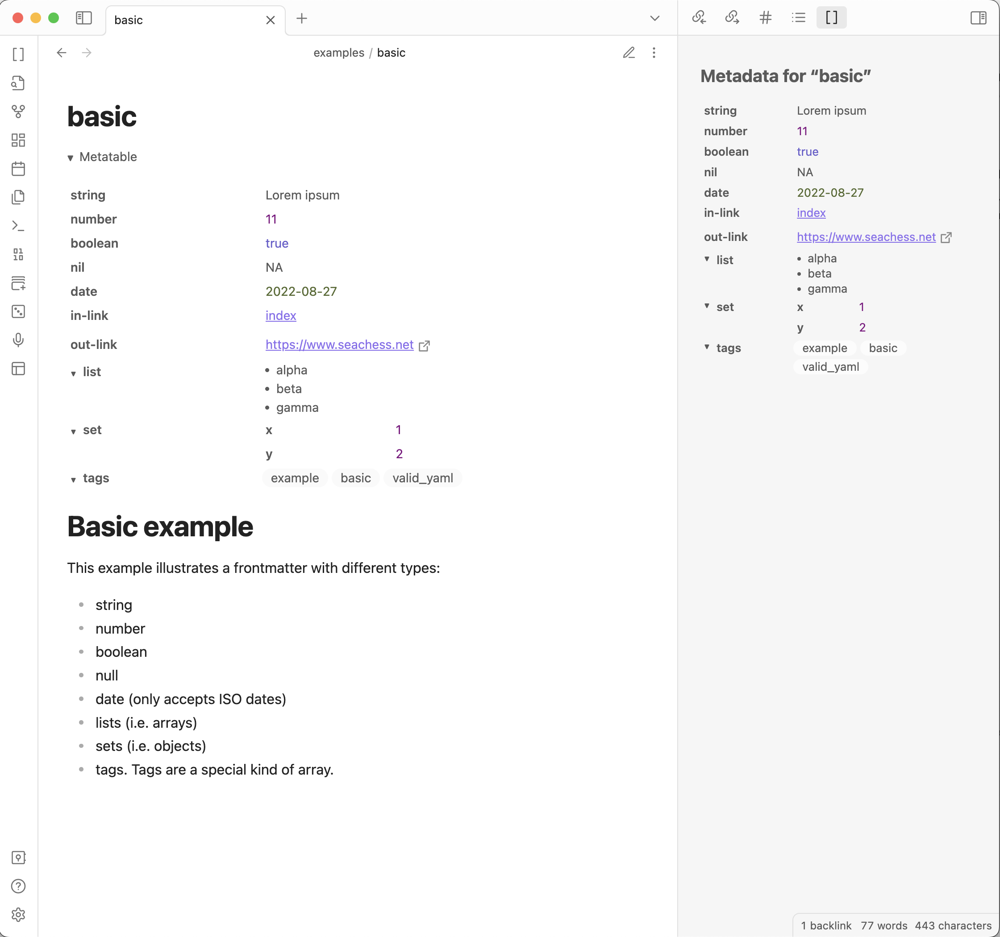

## Obsidian Metatable

A plugin for [Obsidian] to display the full frontmatter block instead of just the list of tags.

## Changelog

- 0.14.4
  - Upgrade to Obsidian 1.1
  - Upgrade dependencies due to CVE-2022-46175
- 0.14.3
  - Fix (#37) local URLs should not be encoded as URIs.
  - Fix tag parts should not be encoded as URIs.
- 0.14.2
  - Fix (#38) tag URLs should not be encoded as URIs.
- 0.14.1
  - Fix (#36) tag normalisation when tags are separated by spaces.
- 0.14.0
  - (**breaking**) Restructure markup and use [Solid.js](https://www.solidjs.com/) instead of plain DOM.
  - (**breaking**) Normalise custom properties. See [customising colours and symbols](https://github.com/arnau/obsidian-metatable/blob/main/docs/sections/customising_colours_and_symbols.md) for the full list.
  - Add parts for leaf types (number, boolean, null, ISO date).
  - Add new [documentation](./docs). **It works as an Obsidian vault**.
  - Add sidebar view.
  - Add experimental "tight" boundary to change styles when the container is smaller than 260px. If and when Obsidian has a web renderer with support for [CSS Container Queries](https://developer.mozilla.org/en-US/docs/Web/CSS/CSS_Container_Queries) this will be reverted.
  - Add Markdown autolinks.

See the [changelog](./CHANGELOG.md) for the full list of version. Or check the
[decision log](./docs/decision_log/) for the main design choices.

## Configuration

By enabling the plugin in the “Community plugins” section you'll be all set.
To see the effects you'll need to open a new document or restart the vault.

Check the [documentation](./docs/index.md) for a getting started, customisation
strategies, examples and more.

## Installation

From Obsidian:

- Ensure Community Plugins are enabled.
- Browse community plugins searching for **metatable**.
- Click install.
- Enable plugin in the “Community Plugins” Settings section.
- Open a file (notice that previously opened files won't get the effects of the plugin until reopened or changed).

From release:

- Download the `obsidian-metatable-{version}.zip` file from the chosen release, for example the [latest release].
- Ensure “Community Plugins” are enabled in Settings.
- Ensure the `.obsidian/plugins/` directory exists in your vault directory.
- Expand the zip file into the `.obsidian/plugins/` directory such that an `obsidian-metatable` directory is a direct child of `plugins`.
- Enable plugin in the “Community Plugins” Settings section.
- Open a file (notice that previously opened files won't get the effects of the plugin until reopened or changed).

From source:

- Clone the [source repository].
- Run `npm install`.
- Run `npm run build`.
- Create an `obsidian-metatable` directory under your vault's `.obsidian/plugins/` directory.
- Copy over `main.js`, `versions.json` and `manifest.json`.
- Enable plugin in the “Community Plugins” Settings section.
- Open a file (notice that previously opened files won't get the effects of the plugin until reopened or changed).

## Licence

Arnau Siches under the [MIT License](./LICENCE)

[Obsidian]: https://www.obsidian.md/
[latest release]: https://github.com/arnau/obsidian-metatable/releases/latest
[source repository]: https://github.com/arnau/obsidian-metatable
